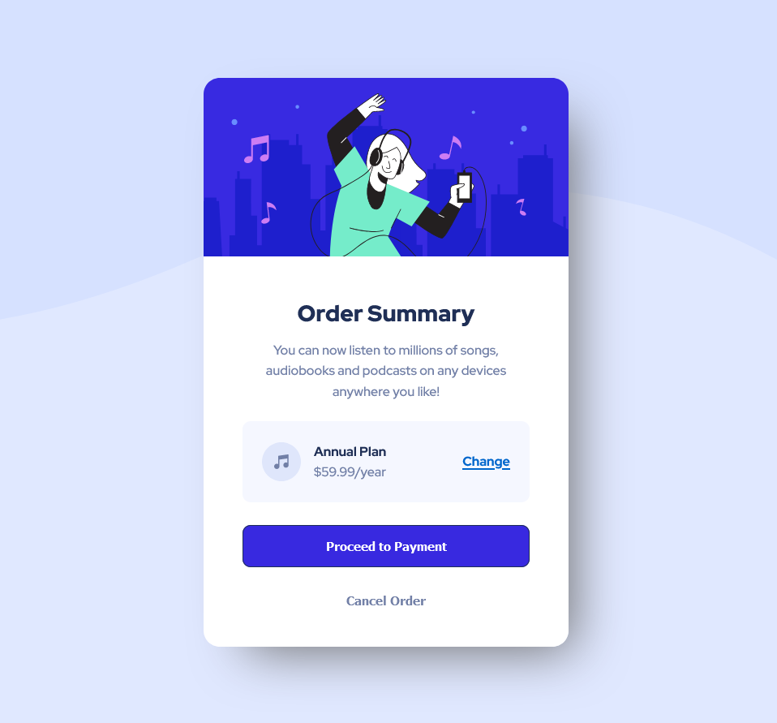

#  Frontend Mentor - Order Summary Component Solution

This is a solution to the [Order Summary Component Solution](https://www.frontendmentor.io/challenges/qr-code-component-iux_sIO_H).

## Table of contents

- [Overview](#overview)
  - [Screenshot](#screenshot)
  - [Links](#links)
- [My process](#my-process)
  - [Built with](#built-with)
- [Author](#author)

## Overview

### Screenshot

### Links

- Solution URL: [Order Summary Component](https://www.frontendmentor.io/solutions/qr-code-component-VKSYoWBeR3)
- Live Site URL: [https://diego-ronan.github.io/qr-code-component/](https://diego-ronan.github.io/order-summary-component/)

## My process

### Built with

- Semantic HTML5 markup
- CSS custom properties
- CSS Grid
- CSS Flexbox

## Author

- Frontend Mentor - [@diego-ronan](https://www.frontendmentor.io/profile/diego-ronan)
